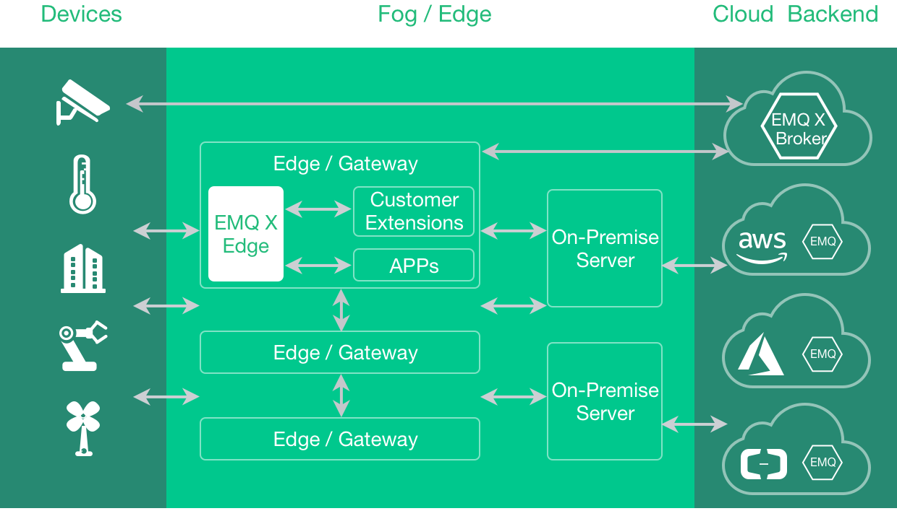

## Get Started 

## Overview 

*EMQ X Edge* is an open source, lightweight MQTT broker running at any resource constraint edge devices. It's written in Erlang/OTP, and Erlang/OTP is a concurrent, fault-tolerant, soft-realtime and distributed programming platform. MQTT is an extremely lightweight publish/subscribe messaging protocol powering IoT, M2M and Mobile applications. 

Highlights of the *EMQ X Edge Broker* : 

  * It supports MQTT, TCP, WebSocket and different industry protocols such ModBus. 
  * It can be running at different kinds of resource constrained edge devices, such as Raspberry Pi, gateway and industrial servers. 
  * It provides local data processing and cloud synchronization which will automatically synchronize data with cloud service based on network status. 
  * Integrated with EMQ X Storm which provides central monitoring and management services. 

## Features 

  * Lightweight - 20MB runtime memory with minimal resource consumption, which can run on ARM/x86 CPU, from Raspberry Pi to industrial X86 servers. 
  * Near real-time response - processing the data generated locally, so it can respond quickly to local events. 
  * Operate online or offline - it operate locally and can cache data when network is not available; when they’re back online it can synchronize data to the cloud and use the cloud for management, analysis and date persistence. 
  * Easy management & monitoring - central edge broker management, data synchronization, visualized monitoring tools based on web UI. 
  * Extensibility - Open APIs available to third party plugins to support more protocols, new functions and features. 

## Quick Start 

### Download and Install 

The *EMQ X Edge* is cross-platform, which could be deployed on Raspberry Pi, Linux and FreeBSD. 

Download binary package from: [ http://emqx.io/downloads ](http://emqx.io/downloads) . 

Installing on Linux, for example: 
    
    
    unzip emqx-edge-centos7-v3.1.zip && cd emqx
    
    # Start EMQ X Edge
    ./bin/emqx start
    
    # Check Status
    ./bin/emqx_ctl status
    
    # Stop EMQ X
    ./bin/emqx stop

### Installing from Source 

::: tip Tip
The *EMQ X Edge* broker requires Erlang/OTP R21+ to build since 3.0 release. 
:::
    
    
    git clone https://github.com/emqx/emqx.git
    
    cd emqx && make rel
    
    cd rel/emqx && ./bin/emqx console

## Plugins 

The *EMQ X Edge* broker could be extended by Plugins. A plugin is an Erlang application that adds extra feature to the *EMQ X Edge* broker: 

[ emqx_retainer ](https://github.com/emqx/emqx-retainer)           |  Store Retained Messages                   
-------------------------------------------------------------------|--------------------------------------------
[ emqx_auth_clientid ](https://github.com/emqx/emqx-auth-clientid) |  Authentication with ClientId              
[ emqx_auth_username ](https://github.com/emqx/emqx-auth-username) |  Authentication with Username and Password 
[ emqx_auth_http ](https://github.com/emqx/emqx-auth-http)         |  Authentication/ACL with HTTP API          
[ emqx_auth_mysql ](https://github.com/emqx/emqx-auth-mysql)       |  Authentication with MySQL                 
[ emqx_sn ](https://github.com/emqx/emqx-sn)                       |  MQTT-SN Protocol Plugin                   
[ emqx_coap ](https://github.com/emqx/emqx-coap)                   |  CoAP Protocol Plugin                      
[ emqx_stomp ](https://github.com/emqx/emqx-stomp)                 |  STOMP Protocol Plugin                     
[ emqx_recon ](https://github.com/emqx/emqx-recon)                 |  Recon Plugin                              
[ emqx_reloader ](https://github.com/emqx/emqx-reloader)           |  Reloader Plugin                           
[ emqx_web_hook ](https://github.com/emqx/emqx-web-hook)           |  Web Hook Plugin                           

A plugin could be enabled by 'bin/emqx_ctl plugins load' command. 

For example, enable 'emqx_auth_mysql' plugin: 
    
    
    ./bin/emqx_ctl plugins load emqx_auth_mysql

## MQTT Client Libraries 

GitHub: [ https://github.com/emqtt ](https://github.com/emqtt)

[ emqttc ](https://github.com/emqtt/emqttc)                   |  Erlang MQTT Client  
--------------------------------------------------------------|----------------------
[ emqtt_benchmark ](https://github.com/emqtt/emqtt_benchmark) |  MQTT benchmark Tool 
[ CocoaMQTT ](https://github.com/emqtt/CocoaMQTT)             |  Swift MQTT Client   
[ QMQTT ](https://github.com/emqtt/qmqtt)                     |  QT MQTT Client      

Eclipse Paho: [ https://www.eclipse.org/paho/ ](https://www.eclipse.org/paho/)

MQTT.org: [ https://github.com/mqtt/mqtt.github.io/wiki/libraries ](https://github.com/mqtt/mqtt.github.io/wiki/libraries)
