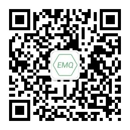

# EMQ X Edge - 物联网边缘消息服务器

_EMQ X Edge_ 是轻量级多协议物联网边缘消息中间件，支持部署在资源受限的物联网边缘硬件。它是连接云端和本地设备之间的桥梁，作为物联网平台体系中的边缘计算节点上运行的消息代理，在边缘节点上使用业务规则引擎将大部分数据进行本地处理，也能够实时响应设备端的请求。

在 EMQ X 边缘节点与后台的 EMQ X 服务器处理集群之间采用加密的传输协议，如果 Edge 节点和远程 EMQ X 之间由于传输网络问题导致连接断开，Edge 节点会自动保存指定的消息到本地的存储，并且在网络正常之后会自动将数据发送到远程的 EMQ X 集群。

_EMQ X Edge_ 完整支持 MQTT V3.1/V3.1.1/V5.0 版本协议规范，并支持 MQTT-SN 、TCP、WebSocket、CoAP、Stomp 等协议。

- MQTT, CoAP, HTTP 以及 MQTT-SN 等各种协议支持
- x86 网关、工业服务器各种资源受限的边缘设备上运行
- 强大规则引擎支持本地数据处理与缓存和云端数据同步
- 提供可视化管理控制台与 REST API 方便本地管理
- 与 KubeEdge 或 [EMQ X Edge Stack](https://github.com/emqx/edge-stack/blob/master/README-CN.md) 集成，远程集中管理监控

_EMQ X_ 项目支持与联系:

| 官网:    | [http://www.emqx.cn](http://www.emqx.cn)                     |
| -------- | ------------------------------------------------------------ |
| 项目:    | [https://github.com/emqx/emqx](https://github.com/emqx/emqx) |
| 微信:    | EMQ303                                                       |
| 微博:    | [http://weibo.com/emqtt](http://weibo.com/emqtt)             |
| Twitter: | @emqtt                                                       |
| 公司:    | 杭州映云科技有限公司                                         |
| 联系:    | contact@emqx.io                                              |

