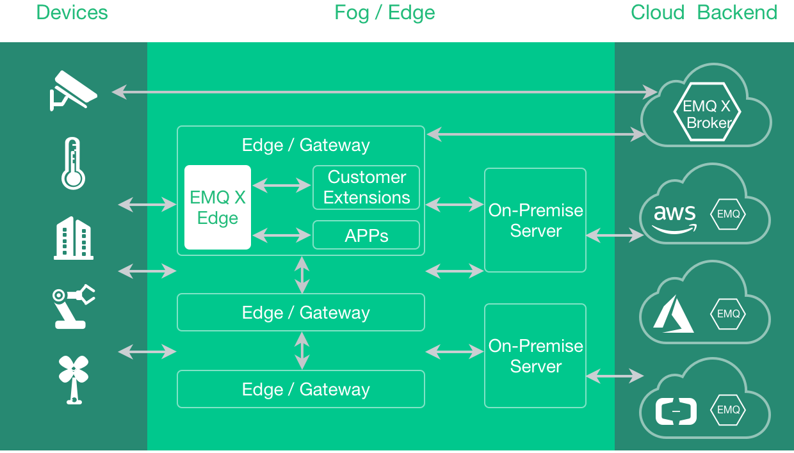

# 开始使用 (Get Started)

## EMQ X Edge 物联网边缘消息服务器简介

EMQ X Edge 边缘消息服务器是连接云端和本地设备之间的桥梁，作为物联网平台体系中的边缘计算节点上运行的消息代理，在边缘节点上使用业务规则引擎将大部分数据进行本地处理，也能够实时响应设备端的请求。在 EMQ X 边缘节点与后台的 EMQ X 服务器处理集群之间采用加密的传输协议，如果 Edge 节点和远程 EMQ 之间由于传输网络问题导致连接断开，Edge 节点会自动保存指定的消息到本地的存储，并且在网络正常之后会自动将数据发送到远程的 EMQ X 集群。

EMQ X Edge 是基于 Erlang/OTP 平台开发的开源物联网 MQTT 消息服务器。Erlang/OTP 是出色的软实时(Soft-Realtime)、低延时(Low-Latency)、分布式(Distributed) 的语言平台。MQTT 是轻量的(Lightweight)、发布订阅模式(PubSub) 的物联网消息协议。

EMQ X Edge 产品特点:

1. 多协议接入: EMQ Edge Broker 支持接入主流的物联网协议，以及支持自定义协议的扩展。
2. 轻量级: EMQ Edge Broker 可以运行在各类工控机（支持 x86、ARM 架构）和树莓派等硬件上，支持各种流行的 Linux 发行版。软件安装包只有 20MB，对资源的消耗比较低，能轻松运行在各类边缘设备上。
3. 消息路由和离线存储: 通过 EMQ X Edge Broker 提供的消息路由和离线存储功能，可以实现对消息自动从边缘到云端的路由；同时在网络不可靠的时候实现本地的离线存储，网络恢复之后自动将本地缓存的消息发送到云端。
4. 易管理: EMQ X Edge 可以通过 EMQ X Storm 管理平台对边缘设备和集群进行可视化管理。
5. 边缘端业务处理: EMQ Edge Broker 在边缘节点通过 MQTT 客户端消费、调用 Webhook 等方式和边缘计算服务连接，实现在边缘端的业务处理，减轻云端的业务处理瓶颈

## 下载和安装

EMQ X Edge 3.1 版本，支持 CentOS、Alpine、Raspbian、Debian、Ubuntu 等平台程序包与 Docker 镜像。

下载地址: [ http://emqx.io/downloads/edge ](http://emqx.io/downloads/edge)

程序包下载后，可直接解压启动运行，例如 CentOS 平台:

    unzip emqx-edge-centos7-v3.1.zip && cd emqx

    # 启动emqx
    ./bin/emqx start

    # 检查运行状态
    ./bin/emqx_ctl status

    # 停止emqx
    ./bin/emqx stop

EMQ X Edge 消息服务默认允许匿名认证，启动后 MQTT 客户端可连接 1883 端口，启动运行日志输出在 log/ 目录。

## 源码编译

    git clone https://github.com/emqx/emqx-rel.git

    cd emqx-rel && make

    cd _rel/emqx && ./bin/emqx console

## _EMQ Xn Edge_ R3.1 扩展插件列表

EMQ X Edge R3.1 支持丰富的扩展插件，包括扩展模块、多种认证方式、多种接入协议等:

| [ emqx_retainer ](https://github.com/emqx/emqx_retainer)           | Retain 消息存储插件    |
| ------------------------------------------------------------------ | ---------------------- |
| [ emqx_auth_clientid ](https://github.com/emqx/emqx_auth_clientid) | ClientId、密码认证插件 |
| [ emqx_auth_username ](https://github.com/emqx/emqx_auth_username) | 用户名、密码认证插件   |
| [ emqx_auth_http ](https://github.com/emqx/emqx_auth_http)         | HTTP 认证插件          |
| [ emqx_auth_mysql ](https://github.com/emqx/emqx_auth_mysql)       | MySQL 认证插件         |
| [ emqx_sn ](https://github.com/emqx/emqx_sn)                       | MQTT-SN 协议插件       |
| [ emqx_coap ](https://github.com/emqx/emqx_coap)                   | CoAP 协议插件          |
| [ emqx_stomp ](https://github.com/emqx/emqx_stomp)                 | Stomp 协议插件         |
| [ emqx_recon ](https://github.com/emqx/emqx_recon)                 | Recon 优化调测插件     |
| [ emqx_reloader ](https://github.com/emqx/emqx_reloader)           | 热升级插件(开发调试)   |
| [ emqx_web_hook ]()                                                | Web Hook 插件          |

扩展插件通过 'bin/emqx_ctl' 管理命令行加载启用。例如启用 MySQL 认证插件:

    ./bin/emqx_ctl plugins load emqx_auth_mysql

## 开源 MQTT 客户端项目

GitHub: [ https://github.com/emqtt ](https://github.com/emqtt)

| [ emqttc ](https://github.com/emqtt/emqttc)                   | Erlang MQTT 客户端库     |
| ------------------------------------------------------------- | ------------------------ |
| [ emqtt_benchmark ](https://github.com/emqtt/emqtt_benchmark) | MQTT 连接测试工具        |
| [ CocoaMQTT ](https://github.com/emqtt/CocoaMQTT)             | Swift 语言 MQTT 客户端库 |
| [ QMQTT ](https://github.com/emqtt/qmqtt)                     | QT 框架 MQTT 客户端库    |

Eclipse Paho: [ https://www.eclipse.org/paho/ ](https://www.eclipse.org/paho/)

MQTT.org: [ https://github.com/mqtt/mqtt.github.io/wiki/libraries ](https://github.com/mqtt/mqtt.github.io/wiki/libraries)
